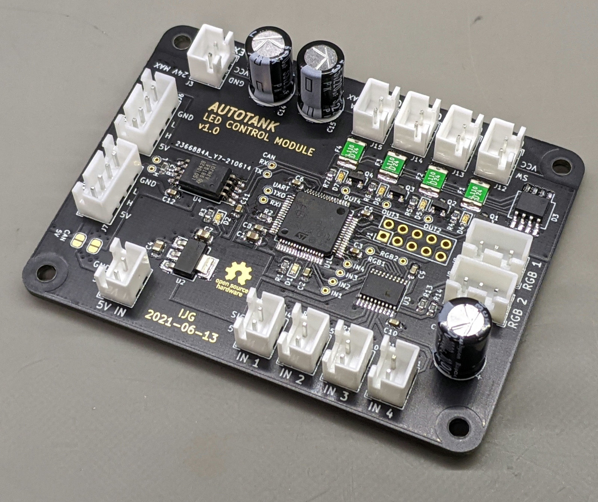
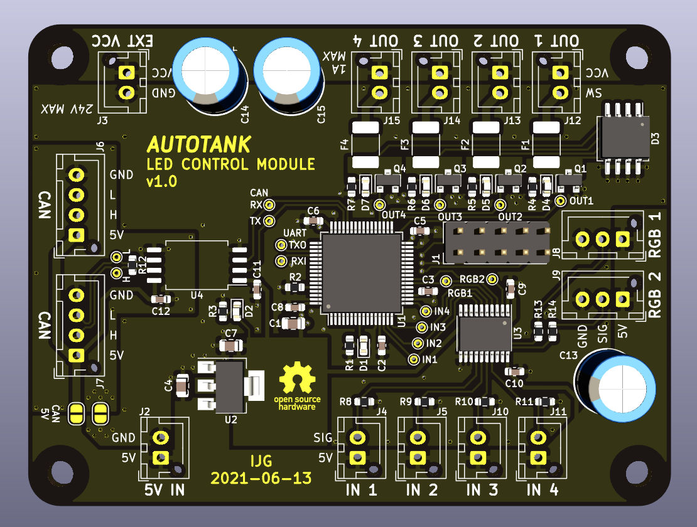

# autotank-led-hw

A CANbus-enabled LED and GPIO controller -- PCB design files

## Theory of Operation

The controller listens for messages on the CANbus and drives two addressable RGB LED strips and four general-purpose open-collector outputs. It also monitors four general-purpose inputs and can send CANbus messages or change outputs in response to events.

The outputs are rated for 1A each and are intended to drive LED lights, such as headlights, tail lights, etc. The inputs are active-high and intended for body sensors and switches, such as a door switch.
